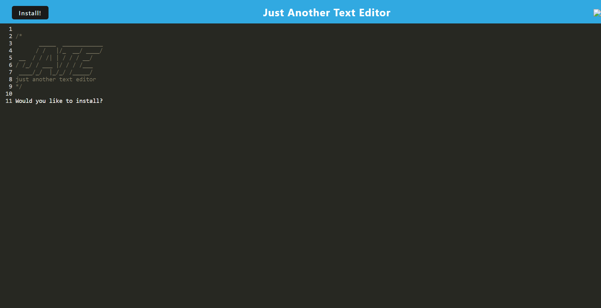

# Offline-Text-Editor
Just another text editor.

## Table of Contents

- [Description](#description)
- [Installation](#installation)
- [Usage](#usage)
- [License](#license)

## Description

Progressive web apps, or PWAs, are what modern applications aspire toward at production. Learning the ways that make an app accessible on mobile devices, as well as offline, or cached, are essential for PWAs. 

- This project taught me about webpack and how to utilize it in my code
- With the webpack, I also utilized babel loader which gave me a lot of debugging to do.
- PWAs aim to allow apps to be used even while offline, think downloading Netlfix movies for a flight but like a lower scale clone
- My biggest takeaway from this was yet another database, the IndexedDB. It isn't meant to hold large amounts of data but can do just fine with simple applications such as this one.

## Installation

Follow along with this video for installation or clone down repo for source code.

## Usage

Follow link to live Heroku site to download the editor from your browser!:

- https://offline-text-editor-for-you.herokuapp.com/

    

## License
MIT License

Copyright (c) 2023 Milton Robles

Permission is hereby granted, free of charge, to any person obtaining a copy
of this software and associated documentation files (the "Software"), to deal
in the Software without restriction, including without limitation the rights
to use, copy, modify, merge, publish, distribute, sublicense, and/or sell
copies of the Software, and to permit persons to whom the Software is
furnished to do so, subject to the following conditions:

The above copyright notice and this permission notice shall be included in all
copies or substantial portions of the Software.

THE SOFTWARE IS PROVIDED "AS IS", WITHOUT WARRANTY OF ANY KIND, EXPRESS OR
IMPLIED, INCLUDING BUT NOT LIMITED TO THE WARRANTIES OF MERCHANTABILITY,
FITNESS FOR A PARTICULAR PURPOSE AND NONINFRINGEMENT. IN NO EVENT SHALL THE
AUTHORS OR COPYRIGHT HOLDERS BE LIABLE FOR ANY CLAIM, DAMAGES OR OTHER
LIABILITY, WHETHER IN AN ACTION OF CONTRACT, TORT OR OTHERWISE, ARISING FROM,
OUT OF OR IN CONNECTION WITH THE SOFTWARE OR THE USE OR OTHER DEALINGS IN THE
SOFTWARE.
